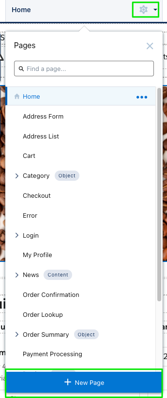
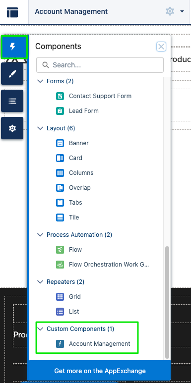
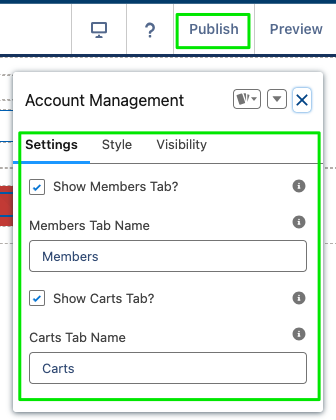
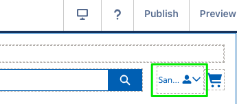
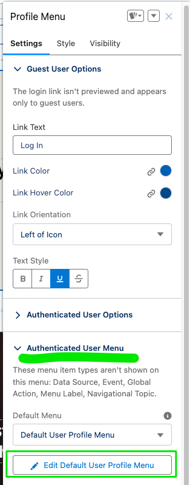
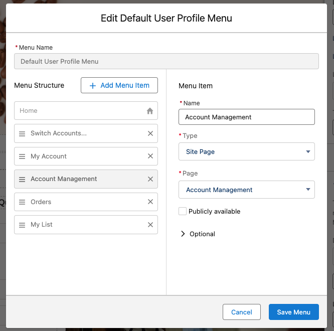
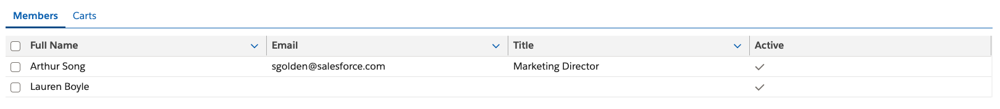
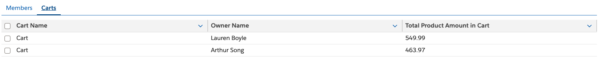
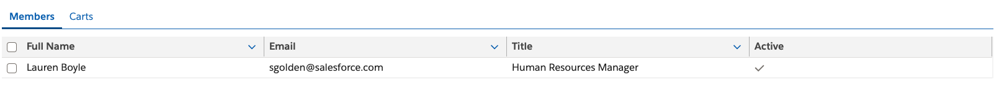
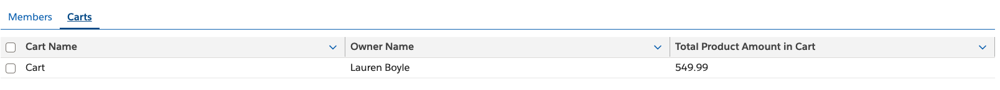

# Account Management (B2B Commerce)

## Table of Contents

Click to open/close

- [Overview](#overview)
- [Deploy](#deploy)
    - [Deploy Using Workbench](#deploy-using-workbench)
    - [Deploy Using sfdx](#deploy-using-sfdx)
- [Update Permissions](#update-permissions)
    - [Allow Profiles to Access the AccountManagement Class](#allow-profiles-to-access-the-accountmanagement-class)
    - [Ensure your Buyer Manager has "Delegated External User Administrator" Permissions](#ensure-your-buyer-manager-has-delegated-external-user-administrator-permissions)
        - [Option 1: Add the Permission to a Permission Set](#option-1-add-the-permission-to-a-permission-set)
        - [Option 2: Add the Permission to a Profile](#option-2-add-the-permission-to-a-profile)
- [Create the Account Management Page](#create-the-account-management-page)
- [Add the Account Management Page to the User Profile Navigation Menu](#add-the-account-management-page-to-the-user-profile-navigation-menu)
- [Confirm the Account Management Page is Working](#confirm-the-account-management-page-is-working)

## Overview
This component lists Community Members/Users and Carts similar to what was previously available on the Aura B2B **Account Management** page.

## Deploy

### Deploy Using Workbench

1. `cd` to the directory containing this file (e.g.: `cd account/accountManagement`).
2. Create a .zip file of this directory: `zip -r -X <your-zip-file>.zip *`
3. Open [Workbench](https://workbench.developerforce.com/) and go to **migration** -> **Deploy**.
4. Click **Choose File** and navigate to the .zip file you created (`<your-zip-file>.zip`).
5. Select **Single Package**
6. Click **Next**
7. Click **Deploy**

### Deploy Using sfdx
Run `sf force mdapi deploy -d <path-to-this-directory> -u <org-username> -w -1`

## Update Permissions

### Allow Profiles to Access the AccountManagement Class
1. Navigate to **Setup** -> **Apex Classes**
2. Click the label for the **AccountManagement** class
3. Click the **Security** button
4. Add all allowed profiles to the **Enabled Profiles** list (e.g.: your `Buyer Profile` or `Customer Community Plus`, etc.)
5. Click **Save**

### Ensure your Buyer Manager has "Delegated External User Administrator" Permissions

#### Option 1: Add the Permission to a Permission Set
> Note: There is an example permission set in this repository called [External User Admin](./permissionsets/External_User_Admin.permissionset-meta.xml). You can use this permission set or create your own.
> 
1. Navigate to **Setup** -> **Users** -> **Permission Sets**
2. Click **New**
3. Enter a Label and Name for the permission set (e.g.: `External User Admin`)
4. Select **Customer Community Plus** for the license
5. Click **Save**
6. Click **App Permissions**
7. Click **Edit**
8. Under **Partner Relationship Management**, check the **Delegated External User Administrator** checkbox
9. Click **Save**
10. Click **Manage Assignments**
11. Click **Add Assignments**
12. Select the applicable Buyer Manager users

#### Option 2: Add the Permission to a Profile
1. Navigate to **Setup** -> **Users** -> **Profiles**
2. Click the label for the applicable profile (e.g.: `Buyer Manager Profile`)
3. Click **Edit**
4. Under **Administrative Permissions**, check the **Delegated External User Administrator** checkbox
5. Click **Save**

## Create the Account Management Page
1. Navigate to **Setup** -> **Digital Experiences** -> **All Sites** -> Click the **Builder** link for your site
2. In the top left hand corner, click the gear icon and then the **+ New Page** button
   - 
3. Click the **Standard Page** tile
4. Enter a **Name** (`Account Management`), **URL** (`account-management`), and API Name (e.g.: `Account_Management`) for the page.
5. Click **Create**
   - 
6. Click the lightning bolt icon in the top left corner of the page
7. Drag the **Account Management** component from the **Custom Components** section to the page
   - 
8. Configure the **Settings** tab on the **Account Management** component
9. Click **Publish** in the top right corner of the page
   - 

## Add the Account Management Page to the User Profile Navigation Menu
1. Navigate to **Setup** -> **Digital Experiences** -> **All Sites** -> Click the **Builder** link for your site
2. On the right hand side, click the **Profile Menu** component
   - 
3. On the Settings tab, expand the **Authenticated User Menu** and click the **Edit Default User Profile Menu** button
   - 
4. Click the **Add Menu Item** button
5. Configure the following:
   - Type: `Site Page`
   - Name: `Account Management`
   - Page: `Account Management`
6. Drag the **Account Management** menu item to the desired location in the menu
7. Click **Save Menu** 
   - 
8. Click **Publish** in the top right corner of the page

## Confirm the Account Management Page is Working
Navigate to the Account Management page in your community and confirm:
1. you see a list of users and carts for your `Buyer Manager` users
   - 
   - 
2. regular buyers see only their own user and cart
   - 
   - 
