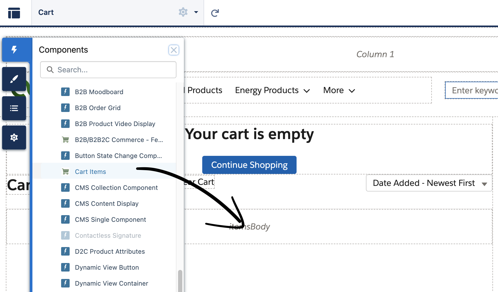
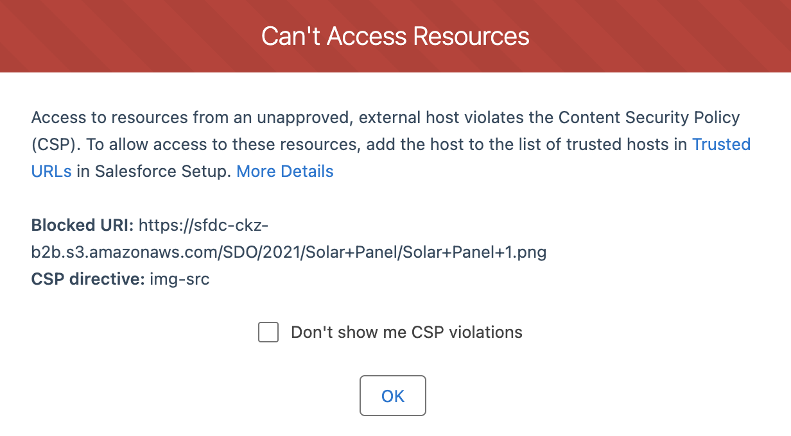
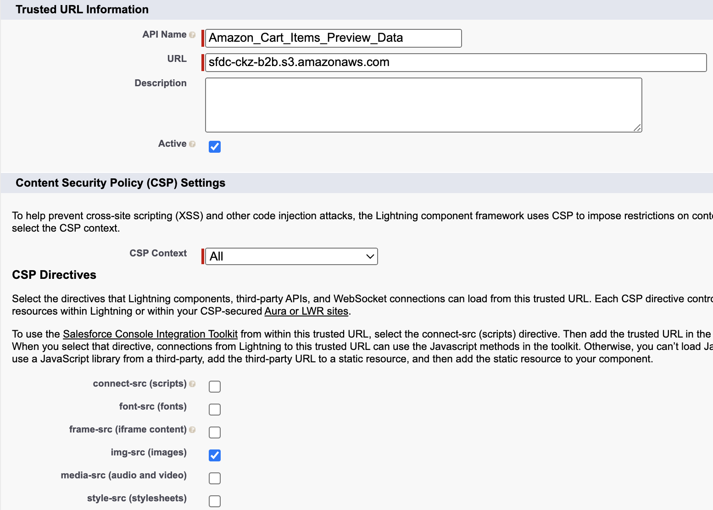
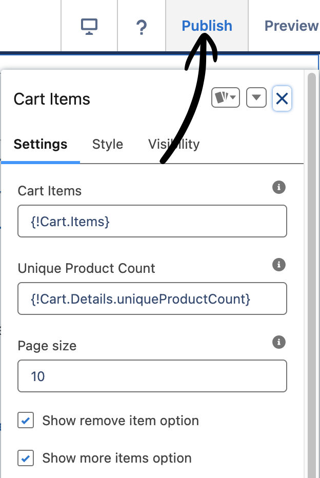

# Cart Items (B2B Commerce and D2C Commerce)

## Table of Contents
- [Overview](#overview)
- [Dynamic Page Size](#dynamic-page-size)
- [Installation Steps](#installation-steps)
- [Considerations](#considerations)

## Overview
These Lightning Web Components represent a light starter pack for displaying cart items, these components support:
- Preview data for Experience Builder
- UI similar to OOTB components
- Relying on --dxp styling hooks for most of the color attributes
- Declarative approach to configuration via properties panel
- Dynamic page size property (check more details [here](#dynamic-page-size))
- Aware of Sorting options set by the OOTB component.
- Basic support of Promotions
- Basic support of Quantity Rules
- No boilerplate Apex code for quick plug-and-play.

## Dynamic Page Size
The component uses the [`CartItemsAdapter`](https://developer.salesforce.com/docs/atlas.en-us.b2b_b2c_comm_dev.meta/b2b_b2c_comm_dev/b2b_b2c_comm_display_lwc_apis.htm#Adapters-in-the-Commerce-Namespace) which fetches by default up to 25 items per request. This custom component handles pagination against the custom property `pageSize` as follows:
- Request up to 25 items from the API
- If the total items to show (calculated based on `pageSize`) is greater than 25, it requests more items from the API
- If the total items to show is less than 25, it shows the total of items specified by `pageSize`
- It repeats this process each time the user requests for more items.

## Installation Steps
1. Deploy both components `cartItem` and `cartItems` to your instance
2. Navigate to the Cart Page in Experience Builder
3. Delete the OOTB 'Cart Items' component
4. Drag the new 'Cart Items'

5. You will see an error like shown below, this will block preview images in the Builder from being displayed (won't block final output in the site):

6. To fix this issue, you should go to `Setup` > `Quick Find` > `Trusted URLs` > Click on `New Trusted URL` and fill in these details:

7. Go back to the Experience Builder and refresh the Cart page, the component should display the preview images correctly.
8. Customize the component settings to your requirements, then, publish the site:

9. Test the component as a logged-in user in the store
10. (Optional) Adapt the component logic to your needs.

## Considerations
This version does not support following features:
- dynamic Custom Labels; hardcoded labels should be replaced with new custom labels
- product variations